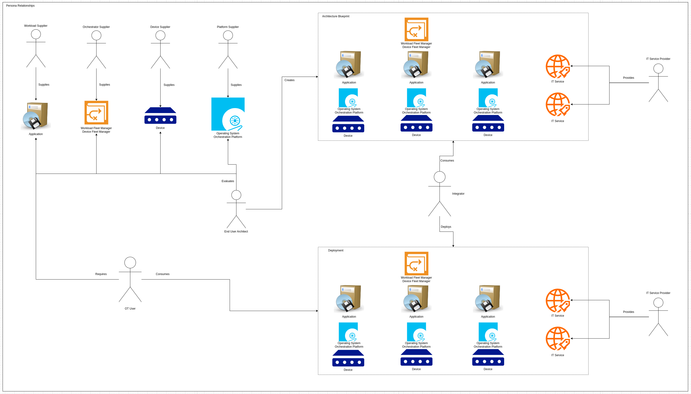

# Personas

Throughout this documentation, the following personas are used to represent interaction with the standard and/or with entities defined by the standard.

## Persona Relationships

## Categories

These categories group common personas together under a shared goal or role. These categories will be used in other documentation to provide grouping and clarity where appropriate.

### End Users
- Consumes products provided by the suppliers
- Evaluates the best-in-class products offered by the suppliers
- Assembles multiple vendor's products into a productive ecosystem

### Suppliers
- Contributes to the Margo specification for their component
- Builds products aligned to the Margo standard
- Markets and sells their products to end users

## Persona Definitions

These persona definitions represent individual entities with specified use cases and requirements, aligned with the other personas in their category.

### End Users

End users consume products and technologies from the suppliers to drive business continuity and efficiency

#### OT User

Consumer of functionality provided by the application vendors to run critical and non-critical business functions, or to improve business efficiency

#### IT Service Provider

Provides "IT-like" services, such as connectivity, backup and restore, automation, security and auditing, etc, at edge sites

#### End User Architect

Creates and enforces standards across deployment locations or sites for greater supportability and consistency

#### Integrator

Optional persona, external to the organization of the other end user personas, but tasked with assembling and installing hardware and software provided by the suppliers

### Suppliers

Suppliers provides hardware or software that's evaluated and deployed by the end users

#### Workload Supplier

Provides an application that performs some desired function, such as computer vision, software-defined control, etc, which is deployed to devices by an orchestrator

#### Orchestrator Supplier

Provides a software package that ingests application definitions into a catalog, and allows an end user to deploy that application to devices

#### Device Supplier

Provides hardware resources, such as CPU and memory, along with lifecycle support, such as firmware and BIOS updates

#### Platform Supplier

Provides operating system level software to abstract hardware resources, and optionally, orchestration software on top of the the operating system layer

## Notes

- Suppliers can assume the role of multiple personas, for example: if the organization provides hardware and platform software
- End users can assume the role of multiple personas, for example: an integrator could be tasked with the end user architect role, along with the integrator role, in a "design and deploy" mindset
- Other personas to be added as requested or required
